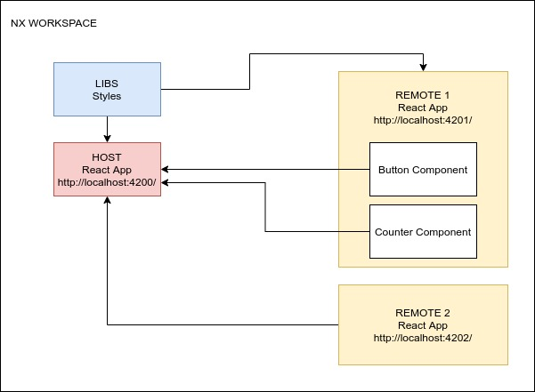

# LABORATORY-MICROFRONTEND

#### What is a microfrontend ?

```
Micro frontends are a new pattern where web application are composed from semi-independent fragments that can be built by different teams using different technologies.
```

## Project



This project is a microfrontend using **NX**, **React** and the **Webpack Module Federation Plugin** with one host and two remotes. I created a library sharing the style to all application that need it, in our case only the host and the remote 1. The host is using the counter and button from the remote 1 and the entire application from remote 2.

This is indeed a simple experimentation on microfrontend but this can be applied to real project such as Amazon where you will create an application for handling the cart, an other one for handling the listing of the object and another one for handling the payment.

## Why use microfrontend ?

I am working on a current product in my company where the entire UI is inside a single project. Because of that, any modification is tough and require a lot of communication and planning. The app is clearly not easy to scale anymore. This monolithic app has the same problem we had before with the server until we discovered the microservices. So why not apply the same principle to the frontend ?

Let me present you the microfrontend. As the microservices, this architecture has a lot of feature:

- **Scalability**: Work can be easily divide among the team. Making a change become easier.
- **Independance**: Each app has his own scope.
- **Reusability**: The code can be reuse again and again in the host.
- **Mixing of technology**: Each app can have his own technology. So a react app can be mix with an angular app and so on...
- **Simplicity**: Since the app is split into multiple small app, learning the app is easier. Not all knowledge need to be absorb in one time.

## Development

#### NX Setup

First, I create a monorepository with NX:

```bash
# Install NX structure
$ npx create-nx-workspace@latest
# Install React generator [Dont forget to CD in your workspace]
$ npm install --save-dev @nrwl/react
```

Once done, I create one react app for hosting the microfrontend and two remote react app:

```bash
nx g @nrwl/react:host host --remotes=remote1,remote2
```

We can now run the app with:

```bash
$ nx serve host
```

For adding a remote after having build the host:

```bash
$ nx g @nrwl/react:remote shop --host=host
```

#### Host Setup

In the file `module-federation.config`, we define our app as a host and what are the remote:

```js
const moduleFederationConfig = {
  name: "host",
  remotes: ["remote1", "remote2"],
};
```

In the `webpack.config.prod`, we define the url for the remote

```js
remotes: [
  ['remote1', '//localhost:4201/'],
  ['remote2', '//localhost:4202/'],
],
```

#### Expose a new component of a remote

For exposing a new component, just modify the file `module-federation.config.js` of the remote:

```js
exposes: {
  './Counter': './src/app/components/Counter/index.tsx',
  './Module': './src/remote-entry.ts',
},
```

In the host, declare the module added. It can be done in any file, I created a file `tsremote_declarations.ts` where I regrouping all the declaration of module:

```js
declare module 'remote1/Counter';
```

#### Synchronizing the style

By creating a style library, I can now apply the same style whatever the application. The result of one component inside one of the remote will be identical to the style inside the host.

```bash
$ nx generate @nrwl/react:library ui
```

## Running

```bash
$ nx serve host
```
